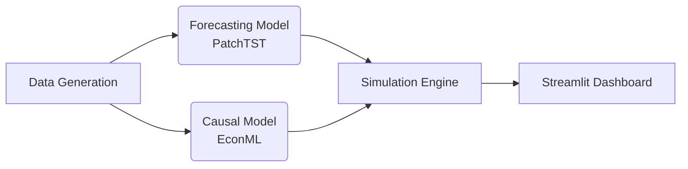

# Dynamic Pricing & Sales Forecast Agent


## 📖 Project Overview
 **Dynamic Pricing & Sales Forecast Agent**는 시계열 예측(Time Series Forecasting)과 인과 추론(Causal Inference) 기술을 결합하여, 가격 정책 변화에 따른 판매량 변화를 시뮬레이션하고 최적의 가격을 제안하는 로컬 AI 에이전트입니다.

기존의 단순 예측 모델이 답하지 못하는 **"만약 가격을 올린다면 판매량은 어떻게 변할까?"(Counterfactual Question)** 에 대한 답을 데이터를 통해 제시합니다.

## 🚀 Key Features
1. **Synthetic Data Generation (합성 데이터 생성)**
   - 가격, 계절성, 노이즈가 반영된 정교한 판매량 데이터 생성
   - Ground Truth 인과 효과 검증 가능

2. **Advanced Forecasting (시계열 예측)**
   - **PatchTST** 등 최신 Transformer 기반 SOTA 모델 활용
   - Baseline(ARIMA/XGBoost) 대비 성능 비교 검증

3. **Causal Inference (인과 추론)**
   - **Microsoft EconML** / DoWhy 활용
   - 가격 탄력성(Price Elasticity) 산출 및 CATE(조건부 평균 처치 효과) 추정

4. **Simulation Dashboard (시뮬레이션)**
   - **Streamlit** 기반 대시보드 제공
   - 가격 슬라이더를 통한 실시간 'What-if' 시나리오 시뮬레이션

## 🛠️ Tech Stack
- **Language**: Python 3.9+
- **Forecasting**: PyTorch, NeuralForecast (PatchTST)
- **Causal Inference**: EconML, DoWhy
- **Data Processing**: Pandas, NumPy
- **Visualization & UI**: Streamlit, Matplotlib, Plotly

## 📂 Architecture


## 🗓️ Roadmap
- **Phase 1**: 데이터 생성 및 ML 환경 구축
- **Phase 2**: 시계열 예측 및 인과 추론 모델링
- **Phase 3**: 시뮬레이션 대시보드 구현 및 통합

## 🏁 Getting Started
```bash
# Clone the repository
git clone https://github.com/ts6nqswnr8-sudo/UpstageDemo.git

# Install dependencies
pip install -r requirements.txt

# Run the dashboard (Phase 3)
streamlit run app.py
```
